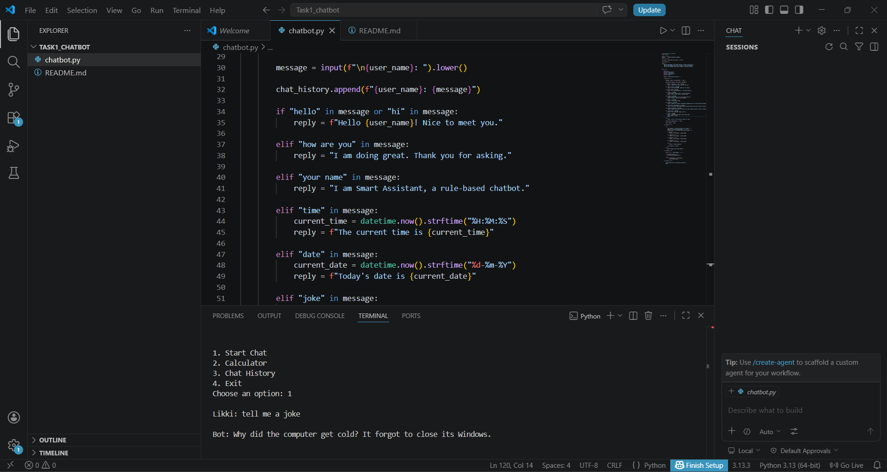

# Smart Assistant Chatbot

## Project Overview

Smart Assistant Chatbot is a rule-based chatbot developed using Python as part of the CodSoft Artificial Intelligence Internship.

The chatbot interacts with users through predefined rules and provides responses to common queries such as greetings, date, time, jokes, and AI-related questions.

---

## Features

- Personalized user greeting
- Time and date information
- Joke generator
- AI and Python-related responses
- Calculator functionality
- Chat history tracking
- User-friendly menu system

---

## Technologies Used

- Python
- Datetime Module
- Random Module

---

## How to Run

1. Open Terminal
2. Navigate to project folder
3. Run:

```bash
python chatbot.py
```

---
## Project Screenshot


---

## Learning Outcomes

Through this project I learned:

- Python programming fundamentals
- Conditional statements
- Loops 
- Functions
- User input handling
- Rule-based chatbot development

---

## Author

Likitha Gedela

CodSoft Artificial Intelligence Internship